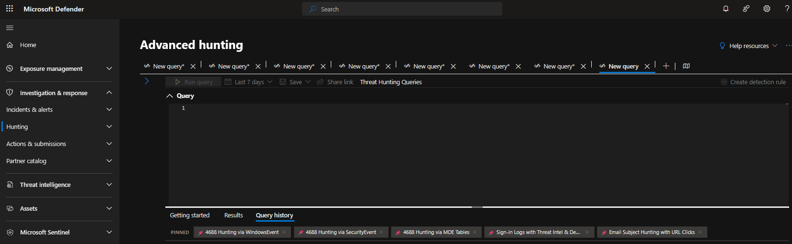
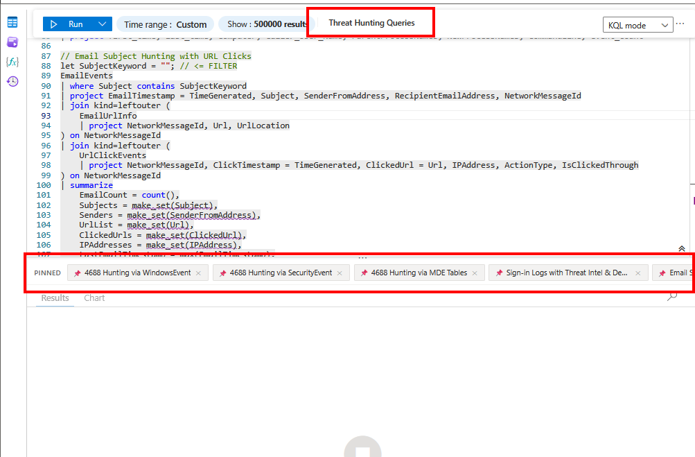
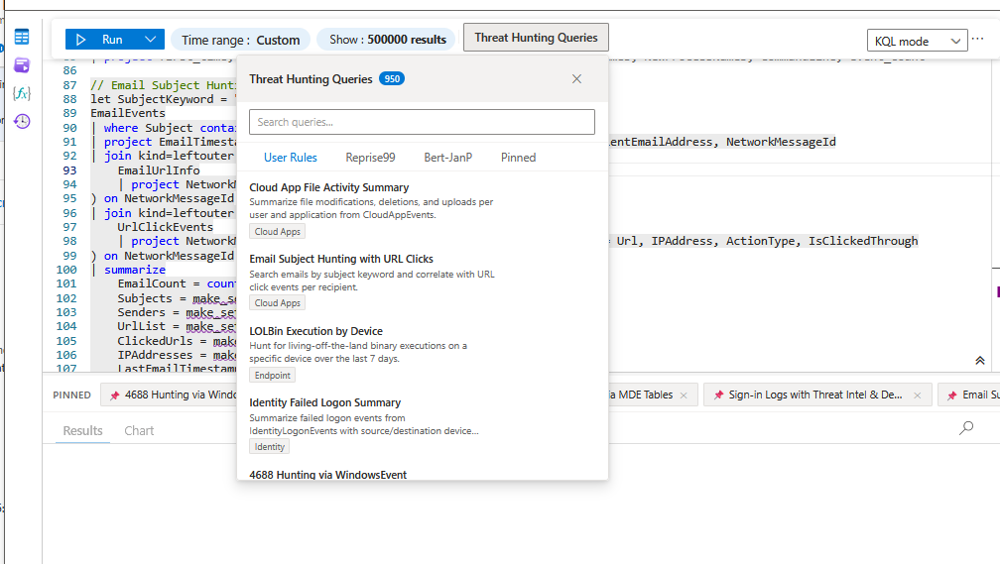

# Microsoft Sentinel & Defender: Threat Hunting Queries

Tampermonkey userscript that adds a threat hunting query menu to **Microsoft Sentinel** and **Microsoft Defender** Advanced Hunting pages.

Browse, search, pin, and inject KQL queries directly into the Monaco editor.

## Screenshots

| Defender (dark mode) | Sentinel | Sentinel (popup) |
|---|---|---|
|  |  |  |

## Features

- Inline "Threat Hunting Queries" button in the command bar
- Tabs: **User Rules** (bundled), **Reprise99**, **Bert-JanP** (fetched from GitHub)
- Search across query name, description, category, and KQL content
- Pin queries for quick access (horizontal pill bar above results)
- Click any query row to inject it into the editor
- Works in both Sentinel (reactblade iframe) and Defender (security.microsoft.com)
- Light/dark theme support via Azure Portal CSS variables

## Install

1. Install [Tampermonkey](https://www.tampermonkey.net/)
2. Click **[Install Userscript](https://raw.githubusercontent.com/LasCC/MicrosoftSentinel-Userscript/main/dist/sentinel-userscript.user.js)** (auto-installs in Tampermonkey)
3. Navigate to Advanced Hunting in Sentinel or Defender

## Public Rule Sources

| Repo | Queries | Format |
|------|---------|--------|
| [reprise99/Sentinel-Queries](https://github.com/reprise99/Sentinel-Queries) | ~460 | `.kql` files |
| [Bert-JanP/Hunting-Queries-Detection-Rules](https://github.com/Bert-JanP/Hunting-Queries-Detection-Rules) | ~445 | `.md` with fenced KQL |

Rules are fetched lazily on first tab click, cached locally for 1 hour.

## Build

```
npm install
npm run build
```

Output: `dist/sentinel-userscript.user.js`

## Related

- [SentinelOne Userscript](https://github.com/LasCC/SentinelOne-Userscript) - Similar project for SentinelOne
